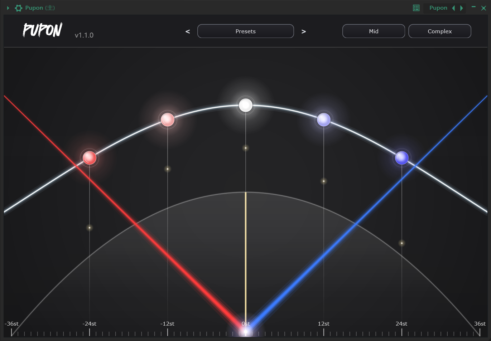
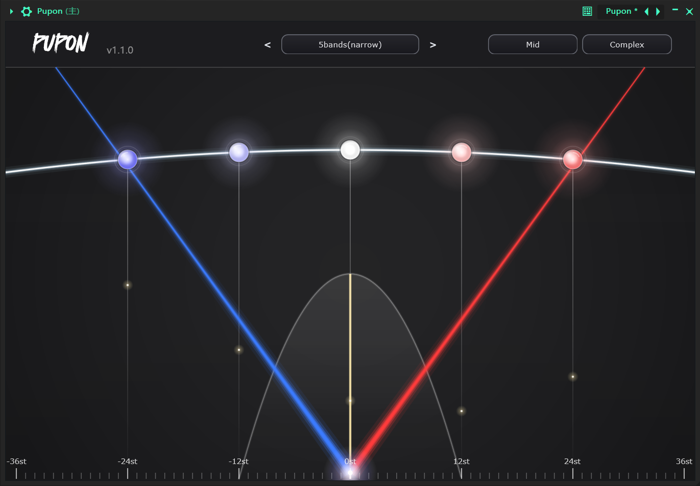

<h1 align="center">Pupon</h1>

<p align="center"><strong>变调 · 珍珠 · 声场</strong></p>

<p align="center">
  <em>五颗珍珠，五个音高，一整片声场</em><br>
  <em>Pitch · Pearls · Stereo Field</em>
</p>

<p align="center">
  
  
  
</p>

<p align="center">
  
  
</p>

---

## 概述 / Overview

**Pupon** 把一次变调拆成**五颗可以随意摆放的珍珠**。每颗珍珠是一条独立的音高轨道，你把它抬高，它就更响；你把它左右拖动，它就移到别的音高上。两条对称的射线决定声场铺开的宽度，一条正态曲线决定音高能量的分布，一条抛物线划定每条轨道的频段窗口。

> **中文**：一款面向声音设计 / 电子制作的**多轨实时变调效果插件**。核心是 5 路并行 pitch shift（默认 −24 / −12 / 0 / +12 / +24 半音），每路独立控制增益、声相与音高，配合高斯能量分布与频段窗口，从"加一层八度"到"把人声摊成一整片和声"都可以在一块画布上完成。

> **English**: A multi-band real-time pitch-shifting effect. Five parallel pitch lanes (default −24 / −12 / 0 / +12 / +24 semitones), each with its own gain, pan and pitch, shaped by a Gaussian energy curve and a per-band filter window — from a single octave layer to spreading a vocal into a full harmonic field.

> 分类 Category：Fx / Pitch ｜ 插件代码 Plug-in Code：`Pupn` ｜ 厂商 Vendor：iisaacbeats.cn

---

## 功能模块 / Modules

| 模块 / Module | 功能描述 / Description |
|------|------|
| **五颗珍珠 5 Pearls** | 5 条并行变调轨道。上下拖动 = 该轨道增益（正态曲线决定上限）；左右拖动 = 该轨道音高（−36 ~ +36 st）。<br>*5 parallel pitch lanes. Drag vertically = gain, drag horizontally = pitch (−36…+36 st).* |
| **红蓝射线 Rays** | 两条左右对称的射线决定声场铺开范围：射线越平，高低音轨道分得越开（声相越大）；射线合拢向上则全部居中。<br>*Two symmetric rays set the stereo spread: flatter rays push outer lanes further L/R.* |
| **正态曲线 Gaussian** | 拖动曲线改变 σ（0.24 ~ 8.0）：σ 小 = 只留原音高附近，σ 大 = 五条轨道一起响。<br>*Drag the curve to change σ (0.24…8.0): narrow = focus on the dry pitch, wide = all lanes.* |
| **滤波器抛物线 Filter** | 拖动中轴平移频段中心（±36 st），拖动抛物线与底部刻度的交点改变频段宽度（10 ~ 72 st）。<br>*Drag the axis to shift the band centre (±36 st), drag the parabola to set its width (10…72 st).* |
| **变调引擎 Engine** | Rubber Band LiveShifter（R3 实时低延迟引擎），3 档质量 Fastest / Mid / Best，共振峰 Complex（跟随变调）/ Vocal（保留）。<br>*Rubber Band LiveShifter, 3 quality tiers, formant shifted or preserved.* |
| **预设 Presets** | `.puponpreset` 文件存放在 `~/Documents/puponpresent`；支持保存、切换文件夹、`<` `>` 快速切换。<br>*.puponpreset files in `~/Documents/puponpresent`; save, change folder, `<` `>` quick switch.* |
| **宿主自动化 Automation** | 16 个参数通过 `AudioProcessorValueTreeState` 暴露给 DAW，可做自动化与 MIDI CC 映射。<br>*16 parameters exposed via APVTS for automation and MIDI learn.* |
| **延迟补偿 Latency** | 5 路各自补齐到统一参考延迟后混音，并把稳定延迟上报给宿主。<br>*All lanes aligned to one reference delay; stable latency reported to the host.* |

---

## 技术栈 / Tech Stack

| 项目 / Item | 版本 / Version |
|------|------|
| 语言 Language | C++17 |
| 框架 Framework | [JUCE](https://juce.com) 8.0.12（FetchContent 自动拉取） |
| 变调库 Pitch engine | [Rubber Band Library](https://breakfastquay.com/rubberband/) v4.0.0（GPL，源码 unity build，含本地重采样质量补丁） |
| 构建 Build | CMake ≥ 3.22 |
| 安装器 Installer | Inno Setup 6（Windows） / `pkgbuild` + `hdiutil`（macOS） |

---

## 构建 / Build

```bash
# 克隆仓库 Clone
git clone https://github.com/sweetorange1/pupon.git
cd pupon

# CMake 配置 & 构建（Release）
# 注意：构建目录建议命名为 cmake-build-release 或 cmake-build-release-visual-studio
# Note: build dir should be cmake-build-release or cmake-build-release-visual-studio
cmake -B cmake-build-release -DCMAKE_BUILD_TYPE=Release
cmake --build cmake-build-release --config Release
```

首次配置需要联网：JUCE 与 Rubber Band 都由 `FetchContent` 拉取，Rubber Band 会自动应用 `cmake/patches/` 下的重采样质量补丁。
*First configure requires network: JUCE and Rubber Band are fetched via `FetchContent`; the local Rubber Band patch is applied automatically.*

构建成功后 VST3 会自动复制到 `%LOCALAPPDATA%\Programs\Common\VST3`（无需管理员权限）。
*On success the VST3 is copied to `%LOCALAPPDATA%\Programs\Common\VST3` (no admin rights needed).*

## 打包安装器 / Packaging

```bash
# Windows（需先安装 Inno Setup 6 / Requires Inno Setup 6）
build_installer.bat
# 产物 Output：dist\Pupon_Setup_1.1.0_x64.exe

# macOS（需在 macOS 上运行 / must run on macOS）
./build_macos_installer.sh          # 产出 .pkg + .dmg
./build_macos_installer.sh --no-sign # 跳过 ad-hoc 签名
```

Windows 安装器将 VST3 装入 `C:\Program Files\Common Files\VST3\iisaacbeats.cn`，并把 `presents\*.puponpreset` 放到 `文档\puponpresent`；若改选其他目录，安装完成后请在 DAW 中手动添加该目录并重新扫描插件。
*The Windows installer places the VST3 into `C:\Program Files\Common Files\VST3\iisaacbeats.cn` and copies presets to `Documents\puponpresent`; if you choose another folder, add it to your DAW and rescan.*

---

## 隐私说明 / Privacy

- **更新检查 Update check**：启动后异步请求 `iisaacbeats.cn` 一次（5s 超时，失败静默），仅在有新版本时弹窗提示。
  *Async check to `iisaacbeats.cn` on startup (5s timeout, silent on failure); prompts only when a new version exists.*
- **匿名遥测 Telemetry**：每日一次匿名的"界面打开"事件（无任何音频数据、无个人身份信息），客户端为随机 UUID。
  *Anonymous "ui opened" event once per day (no audio, no PII), random client UUID.*
- 停用遥测 Disable telemetry：启动前设置环境变量 `IISAAC_TELEMETRY_DISABLED=1`。
  *Set `IISAAC_TELEMETRY_DISABLED=1` before launch.*

---

## 许可 / License

本项目使用 [AGPL-3.0](./LICENSE)（因链接 Rubber Band Library 的 GPL 代码）。
*This project is licensed under [AGPL-3.0](./LICENSE) (it links Rubber Band Library's GPL code).*

第三方组件 Third-party：

| 组件 / Component | 许可 / License |
|------|------|
| JUCE 8 | GPL-3.0 / 商业双授权 GPL-3.0 / commercial dual |
| Rubber Band Library v4.0.0 | GPL-2.0-or-later（商业授权需向 Breakfast Quay 购买） |

---

<p align="center">
  <em>把一次变调，摊成一整片声场。</em><br>
  <em>Spread one pitch shift across a whole field of sound.</em><br><br>
  &copy; 2024-2026 iisaacbeats.cn
</p>
